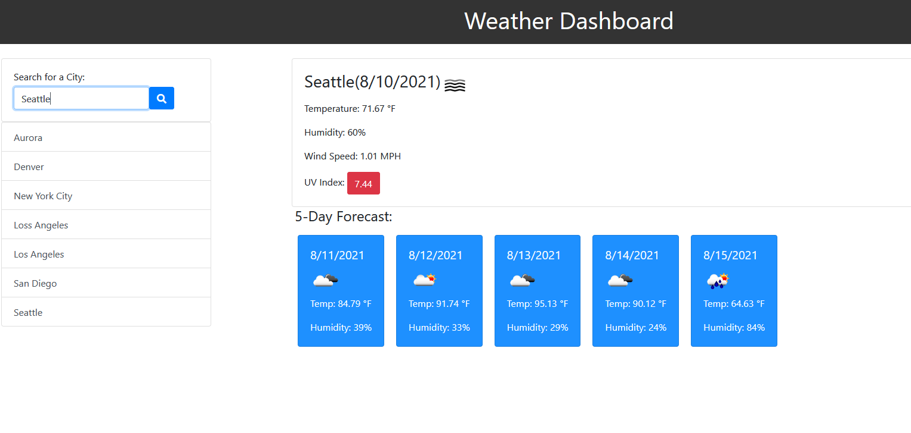

<h1 align="center">Weather Dashboard</h1>

<!-- TABLE OF CONTENTS -->
<details open="open">
  <summary>Table of Contents</summary>
  <ol>
    <li>
      <a href="#about-the-project">About The Project</a>
      <ul>
        <li><a href="#user-story">User Story</a></li>
      </ul>
       <ul>
        <li><a href="#built-with">Built With</a></li>
      </ul>
    </li>
    <li>
      <a href="#links">Links</a>
    <li><a href="#screenshot">Screenshots</a></li>
  </ol>
</details>

## About The Project

Third-party APIs allow developers to access their data and functionalty by making requests with specific parameters to a URL. Developers are often tasked with retrieving data from another application's API and using it in the context of their own. Your challenge is to build a weather dashboard that will run in the browser and feature dynamically updated HTML and CSS.

This repository contains the code for a Weather Dashboard. This Weather Dashboard website uses Third-party APIs to access [OpenWeather One Call API](https://openweathermap.org/api/one-call-api) to retrieve weather data for cities. The Weather Dashboard uses `localStorage` to store any persistent data.

## User Story

```
AS A traveler
I WANT to see the weather outlook for multiple cities
SO THAT I can plan a trip accordingly
```

## Built With

- [HTML](https://html.spec.whatwg.org/)
- [CSS](https://www.w3.org/Style/CSS/Overview.en.html)
- [Javascript](https://www.javascript.com/)
- [Jquery](https://jquery.com/)
- [OpenWeather One Call API](https://openweathermap.org/api/one-call-api)

## Links

- [Website](https://kimshihyun.github.io/Weather-Dashboard/)
- [Github Repo](https://github.com/KimShiHyun/Weather-Dashboard)

## Screenshot

The following image shows the web application's appearance and functionality:


